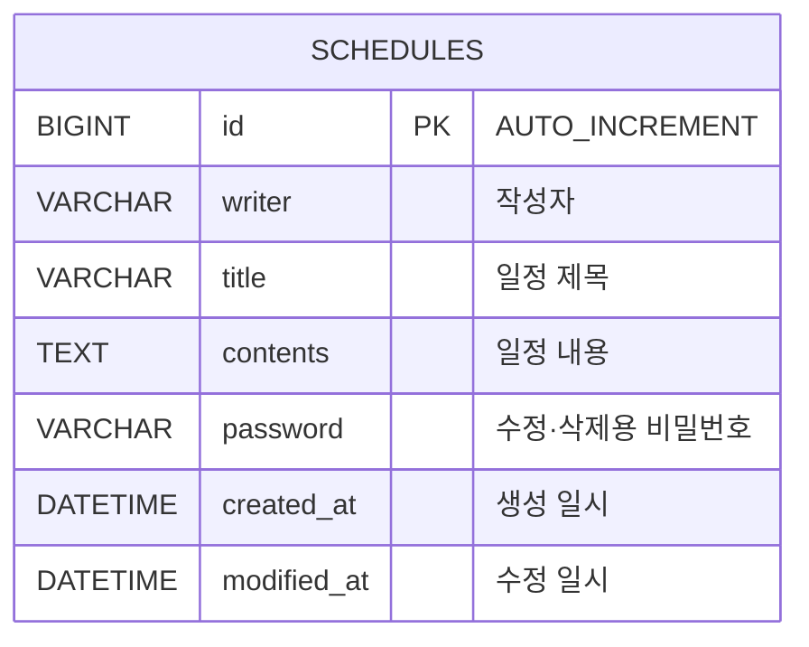

# 📅 일정 관리 REST API

> 부트캠프 Spring 과제로 만든 일정 관리 API 서버입니다.  
> 일정을 등록·조회·수정·삭제할 수 있고, 비밀번호 검증을 통해 작성자만 수정·삭제할 수 있도록 구현했습니다.

<br>

## 📌 프로젝트 정보

| 항목 | 내용 |
| --- | --- |
| 기간 | 2026.06 |
| 인원 | 개인 과제 |
| 구분 | 캠프 Spring 과제 |

<br>

## 🛠 Tech Stack


<br>

## ✨ 주요 기능

- **일정 생성**: 작성자, 제목, 내용, 비밀번호로 일정 등록
- **일정 조회**: 전체 조회, 단건 조회, 작성자 이름으로 필터링 조회
- **일정 수정**: 비밀번호가 일치할 때만 작성자·제목·내용 수정
- **일정 삭제**: 비밀번호가 일치할 때만 삭제
- **생성·수정 시간 자동 기록**: JPA Auditing으로 `createdAt`, `modifiedAt` 자동 관리

<br>

## 📂 프로젝트 구조

```
src/main/java/com/example/schedulesmanager
├── controller   # 요청/응답 처리
├── service      # 비즈니스 로직 (비밀번호 검증, DTO 변환)
├── repository   # JPA Repository
├── entity       # Schedule 엔티티, 생성·수정 시간 공통 엔티티
└── dto          # 요청/응답 DTO
```

<br>

## 🗂 ERD



<br>

## 📡 API 명세

| 기능 | Method | URL | Request | 성공 응답 |
| --- | --- | --- | --- | --- |
| 일정 생성 | POST | `/schedules` | Body | 201 Created |
| 전체 / 작성자별 조회 | GET | `/schedules?writer={writer}` | Query (선택) | 200 OK |
| 단건 조회 | GET | `/schedules/{id}` | Path | 200 OK |
| 일정 수정 | PUT | `/schedules/{id}` | Path + Body | 200 OK |
| 일정 삭제 | DELETE | `/schedules/{id}` | Path + Body | 204 No Content |

요청·응답 예시는 [API 상세 명세](./docs/API.md)에서 확인할 수 있습니다.

<br>

## 💡 구현 포인트

### 1. 계층 분리
Controller는 요청과 응답만, Service는 비즈니스 로직만, Repository는 DB 접근만 담당하도록 나눴습니다.  
엔티티를 그대로 반환하지 않고 응답 DTO로 변환해, **비밀번호가 응답에 노출되지 않도록** 했습니다.

### 2. JPA Auditing으로 시간 자동 관리
생성·수정 시간을 공통 추상 클래스(`@MappedSuperclass`)로 분리하고, `@CreatedDate`, `@LastModifiedDate`로 자동 기록되게 했습니다.

```java
@MappedSuperclass
@EntityListeners(AuditingEntityListener.class)
public abstract class BaseTimeEntity {
    @CreatedDate
    @Column(updatable = false)
    private LocalDateTime createdAt;

    @LastModifiedDate
    private LocalDateTime modifiedAt;
}
```

### 3. 변경 감지(Dirty Checking)를 이용한 수정
수정 시 `save()`를 다시 호출하지 않고, 트랜잭션 안에서 엔티티의 값만 바꿔 JPA가 자동으로 UPDATE 쿼리를 실행하도록 했습니다.

### 4. 쿼리 메서드
`findByWriter(String writer)`처럼 메서드 이름만으로 작성자 조건 조회 쿼리를 생성했습니다.

<br>

## 🚀 실행 방법

1. MySQL에 `schedules` 데이터베이스를 생성합니다.
   ```sql
   CREATE DATABASE schedules;
   ```
2. 환경 변수로 DB 접속 정보를 설정합니다.
   ```bash
   export DB_USERNAME=root
   export DB_PASSWORD=your_password
   ```
3. 애플리케이션을 실행합니다.
   ```bash
   git clone https://github.com/tls123qwe/spring-schedule-api.git
   cd spring-schedule-api
   ./gradlew bootRun
   ```

<br>

## 📈 개선 예정

- [ ] `@RestControllerAdvice`로 예외를 처리해 명세대로 400, 404 응답 반환
- [ ] `@Valid`로 요청값 검증 (필수값, 길이 제한)
- [ ] 수정 응답의 `modifiedAt`이 갱신된 값으로 내려가도록 수정
- [ ] 비밀번호 암호화 저장 (BCrypt)
- [ ] 전체 조회 시 수정일 기준 내림차순 정렬
- [ ] Service, Controller 테스트 코드 작성

<br>

## 📝 회고

콘솔 프로그램에서 벗어나 처음으로 DB와 연결된 API 서버를 만들어본 과제입니다.  
Controller, Service, Repository로 계층을 나누면서 각 계층이 어떤 책임을 가져야 하는지 이해할 수 있었고,  
직접 API 명세서와 ERD를 먼저 작성하면서 설계의 중요성을 느꼈습니다.
